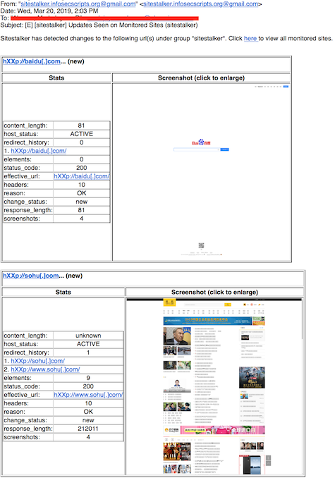
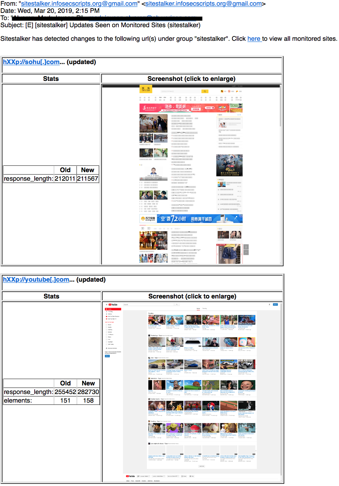
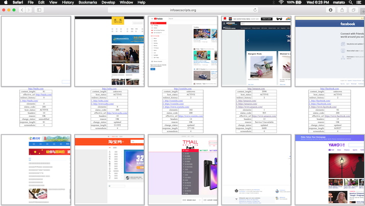

# sitestalker
[](https://www.python.org/downloads/release/python-360/)


_**sitestalker**_ consumes a list of URLs or domains and constantly tracks changes in certain parameters. These parameters are any or combination of the following:

* Content Length - this is an optional [HTTP header](https://en.wikipedia.org/wiki/List_of_HTTP_header_fields).
* Response Length - the computed length of the response from a **GET** request.
* Status Code - refers to [HTTP Status Codes](https://en.wikipedia.org/wiki/List_of_HTTP_status_codes) returned by the server.
* Reason - a short textual description of the status code.
* Headers - number of HTTP headers returned by a server.
* Redirects - number of HTTP redirects before reaching the actual URL
* Elements - number of elements by ID found on the returned page through XPath notation.

Once changes are detected from the previous run, an alert is sent via email. An HTML page containing screenshots of all active hosts is also created. See sample from this [link](http://infosecscripts.org/sitestalker/) (click on the images to view their full sizes.). 

This tool was initially intended to be used for tracking domains that appear to be suspicious. Malicious authors often register domains that closely resembles that of their target organization's when launching a phishing campaign (i.e., [typo-squatting](https://en.wikipedia.org/wiki/Typosquatting)). 

Sometimes, these domains don't have any content yet or in a "parked" status. This tool enables you to monitor these sites and get alerted as soon as the contents have changed (e.g., no longer redirects to a domain registrar's default page). A screen capture of the infringing website is often enough to initiate a takedown process.

_**sitestalker**_ is a free and opensource tool. There is no limit to the number of domains or URLs that you can monitor or frequency of checks performed as opposed to other commercial solutions.

### Sample Console Output
**First Run:**
```
$ python sitestalker.py -i sample.txt

Reading config file: stalker_config.yaml

>Processing group "sitestalker"...
Browsing http://youtube.com...
Browsing http://baidu.com...
Browsing http://tmall.com...
Browsing http://qq.com...
Browsing http://wikipedia.org...
Browsing http://taobao.com...
Browsing http://amazon.com...
Browsing http://facebook.com...
Browsing http://yahoo.com...
Browsing http://sohu.com...
Taking screenshots for http://baidu.com
Taking screenshots for http://sohu.com
Taking screenshots for http://youtube.com
Taking screenshots for http://amazon.com
Taking screenshots for http://facebook.com
Taking screenshots for http://qq.com
Taking screenshots for http://taobao.com
Taking screenshots for http://tmall.com
Taking screenshots for http://wikipedia.org
Taking screenshots for http://yahoo.com
Updating HTML gallery in /var/www/html/sitestalker/test/index.html...
Sending email notification to my_email@mycompany.com
	http://baidu.com (ACTIVE)
	http://sohu.com (ACTIVE)
	http://youtube.com (ACTIVE)
	http://amazon.com (ACTIVE)
	http://facebook.com (ACTIVE)
	http://qq.com (ACTIVE)
	http://taobao.com (ACTIVE)
	http://tmall.com (ACTIVE)
	http://wikipedia.org (ACTIVE)
	http://yahoo.com (ACTIVE)
```
**Second Run:**
```
$ python sitestalker.py -i sample.txt 
Reading config file: stalker_config.yaml

>Processing group "sitestalker"...
Browsing http://youtube.com...
Browsing http://baidu.com...
Browsing http://tmall.com...
Browsing http://qq.com...
Browsing http://verizon.com...
Browsing http://wikipedia.org...
Browsing http://taobao.com...
Browsing http://amazon.com...
Browsing http://facebook.com...
Browsing http://yahoo.com...
Browsing http://sohu.com...
Stats changed for http://facebook.com...
	response_length - Old: 640527	New: 640091
Stats changed for http://amazon.com...
	content_length - Old: 2099	New: 2096
Stats changed for http://qq.com...
	content_length - Old: 47087	New: 47188
	response_length - Old: 240677	New: 240633
Stats changed for http://yahoo.com...
	response_length - Old: 519658	New: 515253
Stats changed for http://youtube.com...
	response_length - Old: 255452	New: 282730
	elements - Old: 151	New: 158
Stats changed for http://sohu.com...
	response_length - Old: 212011	New: 211567
Taking screenshots for http://sohu.com
Taking screenshots for http://youtube.com
Taking screenshots for http://amazon.com
Taking screenshots for http://facebook.com
Taking screenshots for http://qq.com
Taking screenshots for http://yahoo.com
Updating HTML gallery in /var/www/html/sitestalker/index.html...
Sending email notification to my_email@mycompany.com
	http://baidu.com (ACTIVE)
	http://sohu.com (ACTIVE)
	http://verizon.com (ACTIVE)
	http://youtube.com (ACTIVE)
	http://amazon.com (ACTIVE)
	http://facebook.com (ACTIVE)
	http://qq.com (ACTIVE)
	http://taobao.com (ACTIVE)
	http://tmall.com (ACTIVE)
	http://wikipedia.org (ACTIVE)
	http://yahoo.com (ACTIVE)
```

### Sample Email Notification

**First Run:**



**Second Run:**



### Sample HTML Gallery



# Requirements
## BerkeleyDB
**sitestalker** uses an embedded/nosql database BerkeleyDB from Oracle to store monitored sites' statistics and compare the latest from the previous run.
The last version of BerkeleyDB that doesn't have a commercial license is 5.3.x. **sitestalker** makes use of BerkeleyDB 5.3.28 which can be downloaded from this [link](https://www.oracle.com/technetwork/database/database-technologies/berkeleydb/downloads/index-082944.html).

Instructions for building and installation of BerkeleyDB can be found on this [site](https://docs.oracle.com/cd/E17076_05/html/installation/build_unix.html). Typical steps are summarized below:
```
$ cd build_unix
$ ../dist/configure
$ make
$ sudo make install
...
...
Installing DB include files: /usr/local/BerkeleyDB.5.3/include ...
Installing DB library: /usr/local/BerkeleyDB.5.3/lib ...

```
## Python Bindings for BerkeleyDB (bsddb3)
The next step is to install the python library **bsddb3** which provides bindings for the BerkeleyDB database. The latest version comapatible with version 5.3.x can be downloaded from this [page](https://www.jcea.es/programacion/pybsddb.htm) which contains all necessary information: 

###### [bsddb3-5.3.0](https://pypi.org/project/bsddb3/5.3.0/): Testsuite verified with Unix 32 bit Python 2.4-2.7 and 3.1-3.2, and **Berkeley DB 4.3-5.3**. (20120116)

To build and install, use the following command below:

```
python setup.py --berkeley-db-incdir=/usr/local/BerkeleyDB.5.3/include --berkeley-db-libdir=/usr/local/BerkeleyDB.5.3/lib install
```
##  Webdriver and Headless Browser
To take website screenshots, **sitestalker** has to render the webpage on a "headless" browser (a real browser minus the GUI). These so-called "headless browsers" are in turn controlled by a "webdriver" application. Within a python script, webdrivers are controlled using Selenium library that exposes bindings for the webdriver protocol.

The following packages are used by **sitestalker** and were installed via "apt install" command on Ubuntu 16.04
```
$ apt-cache policy chromium-browser
chromium-browser:
  Installed: 71.0.3578.98-0ubuntu0.16.04.1

$ apt-cache policy chromium-chromedriver:
chromium-chromedriver:
  Installed: 71.0.3578.98-0ubuntu0.16.04.1
 
 ```
Another headless browser, **PhantomJS** is used to take full page screenshots. This headless browser although no longer being developed, supports taking full page screenshots that other browsers such as Chrome/Chromium don't. The reason is because the webdriver protocol standard only includes taking screenshots of the "viewport" which is just the visible part of the screen when a page is viewed on a browser. Installation was done using Node Package Manager (npm). **npm** was installed along with nodejs via "apt install".

```
$ apt-install nodejs
```
PhantomJS can then be installed using:
```
$ npm -g install phantomjs-prebuilt
```

## Python Libraries

Installation of other required python libraries are done via the standard "pip install" command. Refer to the main program's source code **(sitestalker.py)** for the list of required python modules via the "import" statements. Example:

```
$ sudo pip install selenium
```

## Others

[Image Magick](https://www.imagemagick.org/) - For cropping, resizing, and thumbnail creation of website screenshots.

# Configuration
On initial run (see below), **sitestalker.py** will create a configuration file "stalker_config.yaml", after which the program exits. 

```
$ python sitestalker.py 
Configuration file written to stalker_config.yaml. Edit this file before running the script.
See https://github.com/gitb0y/phishcracker/blob/master/sitestalker_README.md
```


This should be edited prior to running the script again. See inline comments below for brief explanation of each item. 
```

## group name. sitestalker can monitor multiple groups of sites or URLs. Each group will have its own settings in the configuration file. Specific group name has to be specified in the command line when processing an input file, otherwise the default "sitestalker" group will be selected. See help menu.
sitestalker: 

  ## where db_file will be saved.
  db_dir: stalker_db  
  
  ## database file name
  db_file: stalker.db
  
  email_alerts:
    ## stmp password (e.g., must generate gmail app password when using gmail smtp server)
    password: sender_email_password 
    
    recipients:
    - soc@yourcompany.com
    - soc2@yourcompany.com
    
    ## change this to your sending email address
    sender: sender_email@gmail.com
    
    smtp_port: 465
    ## This could be any smtp server you can use.
    smtp_server: smtp.gmail.com 
    
    subject: '[sitestalker] Updates Seen on Monitored Sites'
    
  ## html gallery output "index.html" will be saved here.
  html_dir: /var/www/html/sitestalker 
  
  ## minimum number of any combination of the monitored_stats required before sitestalker considers the site as updated.
  min_stats: 4
  
  ## parameters to monitor for each url/domain. the following are supported/enabled by default except for the commented ones:
  monitored_stats: 
  #- content_length
  - response_length
  - status_code
  #- reason
  - headers ## saves the header in the database but only counts the difference
  - redirects ## saves the redirect url history but only counts the difference
  - elements ## saves the elements-by-id in the database but only counts the difference
  
  ## number of threads to run for GET requests when retrieving stats. Increase as necessary or if system can handle.
  polling_threads: 20 
  
  ## screenshot images will be saved into this directory. Should be relative to the html_dir, otherwise href to full page screenshots when clicking images on the html gallery may be broken.
  screenshot_dir: /var/www/html/sitestalker/images 
  
  ## URL where html_dir points to. This link will be included in the email alerts so recipients can see the html image gallery
  sitestalker_baseurl: http://www.infosecscripts.org/sitestalker 

group1:
  db_dir: stalker_db
  db_file: group1.db
  email_alerts:
    password: sender_email_password 
    recipients:
    - soc@yourcompany.com
    - soc2@yourcompany.com
    sender: sender_email@gmail.com
    smtp_port: 465
    smtp_server: smtp.gmail.com
    subject: '[sitestalker] Updates Seen on Monitored Sites'
  html_dir: /var/www/html/sitestalker/group1
  min_stats: 2
  monitored_stats:
  - content_length
  - response_length
  - status_code
  - reason
  - headers
  - redirects
  - elements
  polling_threads: 20
  screenshot_dir: /var/www/html/sitestalker/group1/images
  sitestalker_baseurl: http://www.infosecscripts.org/sitestalker/group1  
```
# Input File and Database Purging
Input file can be a list of URLs or domains. Hash(#) prefix ignores the entry and dash (-) removes the URL from the database along with the corresponding screenshots created (if not removed already). When the input file is specified using __--infile__ parameter, a group name using __--group-name__ must also be specified. This means that all insertions and purging of URLs from the input file will happen on the group selected. If not specified, the input file will be processed using the settings from the default group "sitestalker". 

Domains, urls, http/https, "defanged urls" are all accepted inputs. Some error checking is done to avoid processing invalid entries but to be safe, just enter valid ones. Multiple domains or URLs on the same line (whitespace-separated) are handled to some extent. Duplicate or conflicting entries are processed sequentially so having a "purge" entry followed by a valid entry somewhere down the line results in the valid entry being processed repeatedly on every run. Use __--test-infile__ __--verbose__ to test your input file.
```
amazon.com
verizon.com
apple.com
microsoft.com
oracle.com http://www.infosecscripts.org #www.github.com 
att.com
#samsung.com -www.linux.com
-yahoo.com
www.python.com 
http://www.cisco.com
https://www.google.com
hXXp://www.badsite[.]com
```

# Sample Cron Entry and Logging
A "lock file" is created on every run to prevent overlapping executions (e.g., when running as a cron job) with short intervals. See below for a sample cron job entry. Environment variables were taken from **"env(1)"** output. __"--verbose"__ was also specified to produce more information and all output is written to a log file **"/var/log/sitestalker.log"** instead of displaying on the screen. **stdout** buffering is also adjusted using **"stdbuf(1)"** so you can do **"tail -f /var/log/sitestalker.log"** and see realtime ouput.

```
SHELL=/bin/bash
USER=my_username
PATH=/home/my_username/bin:/home/my_username/.local/bin:/usr/local/sbin:/usr/local/bin:/usr/sbin:/usr/bin:/sbin:/bin:/usr/games:/usr/local/games
PWD=/home/my_username/git/phishcracker
HOME=/home/my_username
LOGNAME=my_username


*/5 * * * *  cd ~/path/to/sitestalker/dir && stdbuf -oL /usr/bin/python -W ignore sitestalker.py -c stalker_config.yaml -i infile_sitestalker.txt -g sitestalker -v >> /var/log/sitestalker.log

```


# Sample Log File Rotation Using "logrotate(8)"

```
# cat /etc/logrotate.d/sitestalker
/var/log/sitestalker.log {
    monthly
    missingok
    rotate 10
    compress
    create
}
```


# Help Menu
```
usage: sitestalker.py [-h] [-i [INFILE]] [-c [CONFIGFILE]] [-g [GROUP_NAME]]
                      [-v]

A program that collects and stores statistics of one or more domains or
websites (e.g., potentially brand-infringing parked domains) and monitors
changes in these parameters. Screenshots are taken and email alerts are sent.

optional arguments:
  -h, --help            show this help message and exit
  -i [INFILE], --infile [INFILE]
                        Input file containing a list of domains or URLs to
                        monitor.
  -c [CONFIGFILE], --configfile [CONFIGFILE]
                        sitestalker.py configuration file in yaml format.
                        Initial run will create stalker_config.yaml.
  -g [GROUP_NAME], --group-name [GROUP_NAME]
                        Group in --configfile where the input file belongs to.
                        (i.e., which configuration to use for the
                        --inputfile). Defaults to "sitestalker" group.
  -v, --verbose         Display verbose output in the screen.
  -t, --test-infile     Do nothing, just parse the input file.

EXAMPLE: "python sitestalker.py -i stalker_input.txt -c stalker_config.yaml -g
group1 -v"

  ```

# Future Plans
* Threaded webdriver - Screenshot captures are done sequentially. Selenium Webdriver isn't thread safe. The only way to use it multi-thread is by instantiating a new webdriver for every thread which could be costly, memory-wise. Opening multiple headless browsers at the same time also hogs the memory so this was not implemented. 
* Other enrichments - Additional parameters can be tracked. Enrichment from certstream feeds, whois data, or domain name mangling tools (e.g dnstwist/urlcrazy) for example can be used to automatically populate monitored sites list.
* Migrate to Python 3.x - version 2.7.x of Python is nearing its end-of-life (2020). All projects in this repo will surely be migrated eventually including sitestalker.
